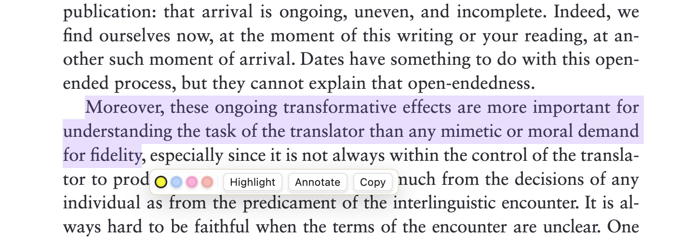
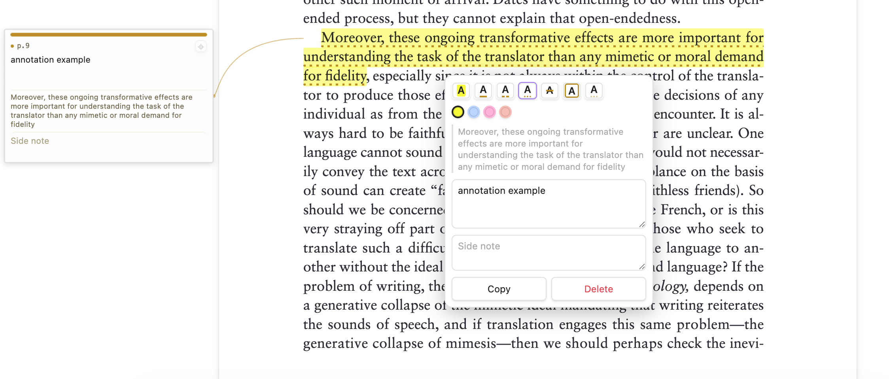

# PDF Annotator

PDF Annotator is a desktop-only Obsidian plugin for reading PDFs, highlighting
passages, and keeping local notes beside the page you are reading.

Open a PDF normally, turn on **Annotate** in the native PDF toolbar, and work in
the same Obsidian PDF view. The plugin does not replace Obsidian's PDF toolbar,
thumbnail/sidebar area, zoom controls, or page navigation.

Annotation data is stored in local Markdown sidecars. By default, sidecars go
under a central `PDF annotations` vault folder so they do not appear beside your
books. The PDF file itself is not modified.



## What You Can Do

- Highlight selected PDF text in Obsidian's native PDF viewer.
- Add a note to a highlight without leaving the PDF tab.
- Keep annotation cards in the left or right rail beside the PDF page.
- Edit notes directly from the side card or from the annotation popover.
- Use different mark styles and colors for emphasis.
- Add page-level notes for thoughts that are not tied to selected text.
- Search highlights, notes, and page tags from the annotation list.
- Pin important side cards so they remain visible.
- Move a card to the left rail, right rail, or automatic placement from the
  card context menu.
- Import legacy `obsidian-annotator` highlights for the current PDF.



## Native PDF Workflow

1. Open a PDF normally in Obsidian.
2. Click **Annotate** in the native PDF toolbar.
3. Select text. Selection alone does not create an annotation.
4. Use the popup to choose **Highlight**, **Annotate**, or **Copy**.
5. Click an existing mark to edit its style, color, note, or side note.
6. Use the side card for quick reading and note editing while the PDF stays in
   the normal Obsidian viewer.

When the PDF is too wide for a readable side card, PDF Annotator uses the native
zoom-out control to create rail space before showing the card. Cards should stay
in the side rails rather than floating over the PDF page.

## Side Cards

Side cards are the margin notes for your PDF. They appear beside the source
highlight at roughly the same vertical position, with a connector line back to
the marked text.

Right-click a side card to:

- pin or unpin it;
- move it to the left rail;
- move it to the right rail;
- return it to automatic placement;
- delete the annotation.

Drag-and-drop between rails is not currently a plugin interaction; use the
right-click card menu to move cards.

## Fallback Annotator View

The original bundled `pdf.js` annotator view is still included as a stable
fallback. Use the command palette action:

```text
Open current PDF in annotator
```

You can also make the fallback annotator the default PDF viewer from plugin
settings. This redirects ordinary `.pdf` clicks into PDF Annotator. The setting
is opt-in for fresh installs.

## Data Format

Each PDF gets a companion file named:

```text
<pdf-name>.annotations.md
```

By default, sidecars are stored under `PDF annotations/`, mirroring the PDF's
vault path. For example, `Books/Novel.pdf` writes to
`PDF annotations/Books/Novel.annotations.md`. Plugin settings can switch back to
the old same-folder layout if you prefer the sidecar beside the PDF.

The sidecar contains a readable Markdown summary and a fenced JSON block that is
used as the machine-readable source of truth. Existing same-folder sidecars are
still read for compatibility.

Highlight geometry is stored in PDF user-space coordinates, so highlights and
tags remain anchored across zoom changes.

## Privacy

PDF Annotator does not use telemetry and does not send PDF contents or
annotation contents to any remote service. Data is stored locally in your vault.

## Legacy Import

If you previously used `obsidian-annotator`, open the target PDF in this plugin
and run:

```text
Import legacy obsidian-annotator highlights for this PDF
```

The importer searches notes with `annotation-target:` frontmatter, re-anchors
quoted text in the PDF, and creates PDF Annotator highlights. Legacy notes are
left untouched.

## Development

```bash
npm install
npm run typecheck
npm run build
```

`npm run build` type-checks the plugin, bundles `main.js`, and copies
`main.js`, `manifest.json`, and `styles.css` into the configured local vault
plugin directory used by this checkout.

## Release Files

Obsidian installs community plugin releases from GitHub release assets. A
release must include:

- `main.js`
- `manifest.json`
- `styles.css`

The release tag must match the `version` field in `manifest.json`.
