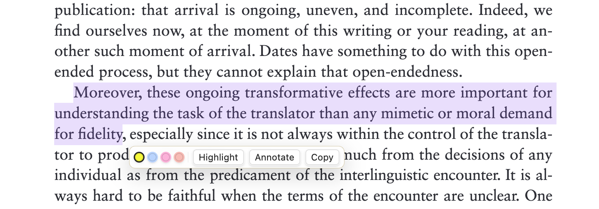

# PDF Annotator

PDF Annotator is a desktop-only Obsidian plugin for reading PDFs, highlighting
passages, and keeping local notes on what you read.

Open a PDF normally, turn on **Annotate** in the native PDF toolbar, and work in
the same Obsidian PDF view. The plugin does not replace Obsidian's PDF toolbar,
zoom controls, or page navigation, and it adds the annotation list to the PDF
sidebar as a third view rather than taking that sidebar over.

Annotations are saved as a plain Markdown sidecar next to the PDF, and the PDF
itself is never modified or duplicated.



## What You Can Do

- Highlight selected PDF text in Obsidian's native PDF viewer.
- Add a note to a highlight without leaving the PDF tab.
- Edit notes in place from the annotation popover.
- Use different mark styles and colors for emphasis.
- Add page-level notes for thoughts that are not tied to selected text.
- Browse and search every highlight, note, and page tag from the annotation
  list, which opens in the PDF sidebar beside Obsidian's own Thumbnails and
  Outline views. Click an entry to jump to it.
- Import legacy `obsidian-annotator` highlights for the current PDF.

## Native PDF Workflow

1. Open a PDF normally in Obsidian.
2. Click **Annotate** in the native PDF toolbar.
3. Select text. Selection alone does not create an annotation.
4. Use the popup to choose **Highlight**, **Annotate**, or **Copy**.
5. Click an existing mark to edit its style, color, note, or side note.

The PDF stays in Obsidian's own viewer throughout. No panel sits over the page
as you read — popovers appear only where you click and close again — and the
plugin never changes your zoom for you.

## Annotation List

Click the list button in the annotation toolbar to see every mark in the
document. It opens inside Obsidian's own PDF sidebar as a third view alongside
**Thumbnails** and **Outline**, with a search box that matches note text, quoted
text, mark kind, and page number — so `3 tag` finds page tags on page 3. Click
an entry to scroll to it and flash the mark.

Picking Thumbnails or Outline, or closing the sidebar, hands the sidebar straight
back to Obsidian. The sidebar's own drag handle sets the width, and the list
adapts to it: narrow shows one line per entry, wider adds the quoted source text.

Clicking an entry scrolls the mark into view and draws a box around it that
bounces for a second, so you can see where you landed.

## Fallback Annotator View

The original bundled `pdf.js` annotator view is still included as a stable
fallback. Use the command palette action:

```text
Open current PDF in annotator
```

You can also make the fallback annotator the default PDF viewer from plugin
settings. This redirects ordinary `.pdf` clicks into PDF Annotator. The setting
is opt-in for fresh installs.

## Data Format

Annotations live in a Markdown sidecar inside a hidden `.annotations` folder in
the PDF's own directory, so nothing extra appears in the file explorer:

```text
Papers/consistent-gdr.pdf
Papers/.annotations/consistent-gdr.annotations.md           # canonical
Papers/.annotations/consistent-gdr.annotations.previous.md  # last-known-good copy
```

The sidecar contains a readable Markdown summary and a fenced JSON block that is
the machine-readable source of truth. `annotations.previous.md` is restored from
if a save is interrupted or corrupted.

Two other locations are available in settings:

| Setting | Sidecar for `Papers/x.pdf` |
| --- | --- |
| Hidden folder beside the PDF *(default)* | `Papers/.annotations/x.annotations.md` |
| Visible, next to the PDF | `Papers/x.annotations.md` |
| In one annotation folder | `PDF annotations/Papers/x.annotations.md` |

Sidecars written under any of these are found and imported automatically, so
switching is safe. When annotations are imported from one location into another,
the file they came from is renamed to `.migrated.md` rather than deleted — it
stays as a snapshot, but can no longer be mistaken for current state if you
switch modes again later.

Because hidden files are not part of Obsidian's index, sidecars in the default
location do not appear in search or the graph, and some sync tools skip
dot-folders. If yours does, include `.annotations` explicitly, or pick one of the
visible locations.

### How annotations stay attached to the right PDF

The PDF's path locates its sidecar; a SHA-256 hash of the PDF bytes, stored
inside the sidecar, proves the sidecar belongs to it. Every save also records the
page count and byte length.

- **Reopening an annotated PDF** turns annotation mode on by itself, so your
  marks are visible immediately without pressing **Annotate**. PDFs with no
  annotations open in the plain native viewer as before. Turn this off with
  *Open annotation mode automatically* in settings.
- **Renaming or moving a PDF in Obsidian** moves its sidecars with it, including
  into a `.annotations` folder created in the destination directory.
- **Replacing a PDF with different bytes** is detected on open. The plugin tells
  you the document changed, says whether the page count still matches, and lets
  you keep the annotations, start fresh, or not open at all. Nothing is decided
  for you, and "start fresh" renames the old sidecar to `.superseded.md` rather
  than deleting it.
- **Moving a PDF outside Obsidian**, where no rename event reaches the plugin,
  is recovered from if the orphaned sidecar's hash or PDF fingerprint uniquely
  identifies the document.
- **Deleting a PDF** moves its sidecars to the trash along with it, following
  your Obsidian deletion setting. This only ever happens in response to an
  actual deletion — a PDF that is merely missing, for example during a partial
  sync, never triggers it.

Highlight geometry is stored in PDF user-space coordinates, so highlights and
tags remain anchored across zoom changes — and stay correct when the same
document is re-downloaded or re-saved with the same pagination.

Use **Export annotations for current PDF** to create a user-visible snapshot
under `PDF annotations/Exports/`.

The sidecars are ordinary files in your vault, so the vault itself should remain
covered by iCloud, Obsidian Sync, or another backup system.

### Upgrading from managed bundles

Earlier versions kept a content-addressed bundle per document under
`.pdf-annotator/bundles/sha256/<hash>/`, including a byte-for-byte copy of the
PDF. Annotations still stored there are imported the first time you open the
PDF. Two commands complete the move:

1. **Migrate annotations out of managed bundles** — writes every remaining
   bundle's annotations beside its PDF and reports anything it could not place.
2. **Reclaim space from annotation backups** — deletes the duplicated PDF copies
   after confirmation. It refuses to run while any bundle still holds
   annotations, so the copies can never go before the annotations are out.

## Privacy

PDF Annotator does not use telemetry and does not send PDF contents or
annotation contents to any remote service. Data is stored locally in your vault.

## Legacy Import

If you previously used `obsidian-annotator`, open the target PDF in this plugin
and run:

```text
Import legacy obsidian-annotator highlights for this PDF
```

The importer searches notes with `annotation-target:` frontmatter, re-anchors
quoted text in the PDF, and creates PDF Annotator highlights. Legacy notes are
left untouched.

## Development

```bash
npm install     # or: yarn install
npm run typecheck
npm test
npm run build
```

`npm run build` type-checks the plugin, bundles it, and writes the three release
files (`main.js`, `manifest.json`, `styles.css`) into `dist/`. No vault is
required to build.

### Installing into a vault while developing

To have every build install itself into Obsidian, tell the build where your
plugin folder is — either copy `.plugin-dir.example` to `.plugin-dir` and put the
path on one line:

```text
/absolute/path/to/YourVault/.obsidian/plugins/local-pdf-annotator
```

…or set `LOCAL_PDF_ANNOTATOR_PLUGIN_DIR`, which takes precedence:

```bash
LOCAL_PDF_ANNOTATOR_PLUGIN_DIR=/tmp/staging npm run build
```

`.plugin-dir` and `dist/` are gitignored, so no machine-specific path is ever
committed. With neither configured the build simply produces `dist/` and says so.

The configured folder's **parent** must already exist — the build creates the
plugin folder itself but never invents a vault around it, so a stale path from
another machine fails immediately with a readable message.

`npm run dev` runs the same pipeline in watch mode, reinstalling on every rebuild.

## Release Files

Obsidian installs community plugin releases from GitHub release assets. A
release must include:

- `main.js`
- `manifest.json`
- `styles.css`

`npm run build` puts exactly these three files in `dist/`, so the release assets
are whatever `dist/` contains after a production build.

The release tag must match the `version` field in `manifest.json` (and the entry
added to `versions.json`).
